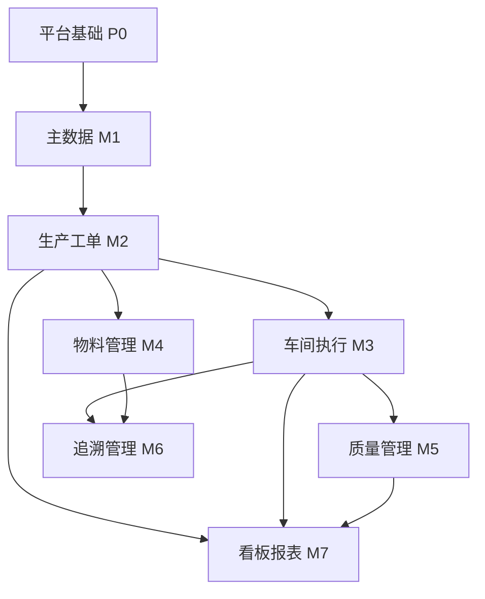

# MES 系统 PRD（MVP）

## 项目目标

构建面向**离散制造、单工厂、单产线**场景的 MES 系统 MVP，跑通「主数据 → 工单 → 车间报工 → 完工追溯」的最小制造闭环，实现生产执行过程的可视、可控、可追溯。

## MVP 范围

### 纳入范围

- 单租户、单工厂
- 产品 / 物料 / BOM / 工艺路线 / 工位等主数据
- 工单全生命周期（创建 → 下达 → 执行 → 完工）
- 工序级报工（开工、完工、良品 / 不良数量）
- 批次级物料消耗与简单追溯
- 工序级质检（合格 / 不合格）
- 基础生产看板与报表

### 明确不做（留待 V2+）

- 高级排程（APS）、多工厂、多租户
- 完整 WMS（入库、出库、库位、盘点）
- 设备维护（CMMS）、OEE 深度分析
- ERP / PLM / 设备 IoT 集成
- 移动端离线、条码硬件深度集成（MVP 可预留字段，不强制）

## 用户角色

| 角色 | 主数据 | 工单 | 报工 | 质检 | 报表 |
|------|--------|------|------|------|------|
| 系统管理员 | 读写 | 读写 | 读 | 读 | 读 |
| 计划员 | 读 | 读写 | 读 | 读 | 读 |
| 班组长 | 读 | 读 / 下达 | 读写 | 读写 | 读 |
| 操作工 | — | 读 | 读写 | 读 | — |

## 模块划分

按 **8 个业务模块 + 1 个平台模块** 划分：

| 序号 | 模块名称 | 职责 | MVP 核心实体 |
|------|----------|------|--------------|
| P0 | 平台基础 | 认证、权限、审计、系统参数 | 用户、角色、权限、操作日志 |
| M1 | 主数据管理 | 生产基础资料维护 | 物料、产品、BOM、工艺路线、工序、工位 |
| M2 | 生产工单 | 计划落地与工单管控 | 生产工单、工序任务 |
| M3 | 车间执行 | 现场作业与报工 | 报工记录、工序状态 |
| M4 | 物料管理 | 工单领料与消耗 | 领料单、消耗记录、库存快照 |
| M5 | 质量管理 | 工序质检与不良记录 | 检验单、不良原因、处置结果 |
| M6 | 追溯管理 | 批次正向 / 反向查询 | 批次、追溯链 |
| M7 | 看板报表 | 可视化与统计 | 工单进度、产量、不良率 |

### 模块依赖关系



## 功能列表

### P0 · 平台基础

| 功能编号 | 功能名称 | 说明 | 优先级 |
|----------|----------|------|--------|
| P0-01 | 用户登录 / 登出 | JWT + Refresh Token，Redis 会话 | P0 |
| P0-02 | 角色与权限 | RBAC：管理员、计划员、班组长、操作工 | P0 |
| P0-03 | 用户管理 | 增删改查、启用 / 禁用 | P0 |
| P0-04 | 操作审计日志 | 关键业务操作留痕（谁、何时、做了什么） | P1 |
| P0-05 | 数据字典 | 单位、不良原因、工单状态等枚举 | P0 |

### M1 · 主数据管理

| 功能编号 | 功能名称 | 说明 | 优先级 |
|----------|----------|------|--------|
| M1-01 | 物料主数据 | 原料 / 半成品 / 成品，编码、名称、规格、单位 | P0 |
| M1-02 | 产品主数据 | 关联成品物料，启用 / 停用 | P0 |
| M1-03 | BOM 维护 | 单层 BOM（父件 → 子件 + 用量） | P0 |
| M1-04 | 工艺路线 | 产品对应工序序列（顺序、标准工时） | P0 |
| M1-05 | 工序定义 | 工序编码、名称、是否必检 | P0 |
| M1-06 | 工位 / 工作中心 | 产线、工位，可绑定默认工序 | P1 |
| M1-07 | 主数据导入 | Excel 批量导入（物料、BOM） | P2 |

**MVP 约束：** BOM 仅支持单层；工艺路线为线性序列，不支持并行 / 分支。

### M2 · 生产工单

| 功能编号 | 功能名称 | 说明 | 优先级 |
|----------|----------|------|--------|
| M2-01 | 工单创建 | 选产品、数量、计划日期，自动生成工序任务 | P0 |
| M2-02 | 工单列表与筛选 | 按状态、产品、日期筛选 | P0 |
| M2-03 | 工单下达 | 草稿 → 已下达，锁定 BOM / 工艺引用 | P0 |
| M2-04 | 工单暂停 / 恢复 | 异常停线场景 | P1 |
| M2-05 | 工单完工关闭 | 全部工序完成后关单 | P0 |
| M2-06 | 工单取消 | 未开始执行的工单可取消 | P1 |
| M2-07 | 工序任务视图 | 按工单展开工序任务清单及状态 | P0 |

### M3 · 车间执行

| 功能编号 | 功能名称 | 说明 | 优先级 |
|----------|----------|------|--------|
| M3-01 | 待办工序列表 | 操作工 / 班组长查看本工位待执行工序 | P0 |
| M3-02 | 工序开工 | 记录开始时间、操作人 | P0 |
| M3-03 | 工序报工 | 录入良品数、不良品数 | P0 |
| M3-04 | 工序完工 | 记录结束时间，推进下一工序 | P0 |
| M3-05 | 报工修正 | 班组长在限定时间内修正报工（需留审计） | P1 |
| M3-06 | 现场看板（工位级） | 当前工单、当前工序、进度 | P1 |

**业务规则：**

- 工序须按工艺路线顺序执行，不可跳序
- 报工总量不得超过工单计划量（可配置是否允许超产）
- 同一工序同时仅允许一个「进行中」状态

### M4 · 物料管理

| 功能编号 | 功能名称 | 说明 | 优先级 |
|----------|----------|------|--------|
| M4-01 | 工单领料 | 按 BOM 生成领料建议，确认领料 | P0 |
| M4-02 | 物料消耗登记 | 报工时关联消耗数量 | P0 |
| M4-03 | 库存快照 | 期初库存 + 领料 − 消耗 = 当前库存 | P1 |
| M4-04 | 批次号管理 | 领料 / 消耗时绑定批次号 | P0 |
| M4-05 | 缺料预警 | 领料时库存不足提示 | P2 |

**MVP 约束：** 不做采购、入库、库位管理；库存为「逻辑库存」，支持手工期初录入。

### M5 · 质量管理

| 功能编号 | 功能名称 | 说明 | 优先级 |
|----------|----------|------|--------|
| M5-01 | 工序质检登记 | 必检工序完工前须质检 | P0 |
| M5-02 | 检验结果录入 | 合格 / 不合格 + 抽检数量 | P0 |
| M5-03 | 不良原因维护 | 数据字典维护不良代码 | P0 |
| M5-04 | 不良品处置 | 返工 / 报废（影响报工数量） | P1 |
| M5-05 | 质检记录查询 | 按工单、工序、日期查询 | P1 |

### M6 · 追溯管理

| 功能编号 | 功能名称 | 说明 | 优先级 |
|----------|----------|------|--------|
| M6-01 | 成品批次生成 | 工单完工时自动生成成品批次号 | P0 |
| M6-02 | 正向追溯 | 成品批次 → 原料批次 → 工单 → 工序 | P0 |
| M6-03 | 反向追溯 | 原料批次 → 影响了哪些成品批次 | P0 |
| M6-04 | 追溯报告导出 | 追溯链导出 PDF / Excel | P2 |

### M7 · 看板报表

| 功能编号 | 功能名称 | 说明 | 优先级 |
|----------|----------|------|--------|
| M7-01 | 生产概览看板 | 在制工单数、今日产量、完工率 | P0 |
| M7-02 | 工单进度跟踪 | 各工单工序完成百分比 | P0 |
| M7-03 | 产量统计报表 | 按产品 / 日期统计良品、不良品 | P1 |
| M7-04 | 不良率分析 | 按不良原因、工序聚合 | P1 |
| M7-05 | 操作工绩效 | 报工数量、工时统计 | P2 |

## 核心业务流程

### 工单状态流转

```
草稿 → 已下达 → 生产中 → 已完工
         ↓         ↓
       已取消    已暂停 → 生产中
```

### 端到端制造闭环

1. **主数据准备：** 计划员 / 管理员维护物料、产品、BOM、工艺路线、工序、工位
2. **工单创建与下达：** 计划员创建工单，系统按工艺路线生成工序任务；班组长 / 计划员下达工单
3. **领料：** 按 BOM 生成领料建议，确认领料并绑定原料批次号
4. **车间执行：** 操作工按序开工 → 报工（良品 / 不良）→ 完工；必检工序须完成质检
5. **物料消耗：** 报工时登记物料消耗，更新逻辑库存
6. **工单关闭：** 全部工序完成后关单，自动生成成品批次号
7. **追溯查询：** 通过成品批次正向追溯至原料与工序，或通过原料批次反向追溯至成品
8. **看板统计：** 生产概览、工单进度、产量与不良率报表

## 验收标准

1. **主数据完整：** 至少 1 个产品含 BOM + 工艺路线可在系统中维护
2. **执行闭环：** 工单从创建到完工，工序按序报工，状态自动流转
3. **数据准确：** 报工数量、质检结果、物料消耗数据一致可追溯
4. **追溯可用：** 任意成品批次可查到原料批次与工序记录
5. **权限有效：** 四类角色按权限矩阵访问，无越权
6. **可演示：** 15 分钟内可完成端到端 Demo
